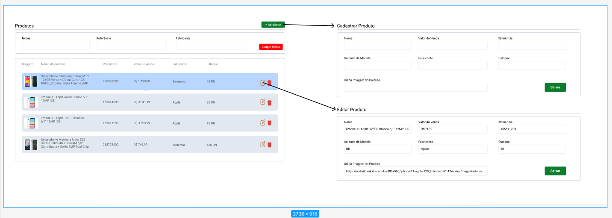

# CRUD-de-Produtos

Um CRUD (Criar, Ler, Editar e Deletar) em uma API em JS puro.

O CRUD foi feito em uma API para produtos.

<h1>Tecnologias utilizadas:</h1>

<h1>Objetivos:</h1>

Esse projeto foi desenvolvido para um teste de FRONT-END com os requisitos:

<h3>Criação e Edição</h3>

Nome (String) (Obrigatório)

Valor de venda (Float) (Obrigatório)

Referência (String) (Obrigatório)

Unidade de medida (String) (Obrigatório)

Fabricante (String) (Opcional)

Estoque (Integer) (Opcional)

<h3>Filtros</h3>

Nome

Fabricante

Fabricante

<h3>Diferenciais</h3>

Estoque (Opção de Ordenação)

Valor da Venda (Opção de Ordenação)

Imagem do Produto (String) (Opcional)

<h1>Foi proprosto o layout no figma a seguir:</h1>

